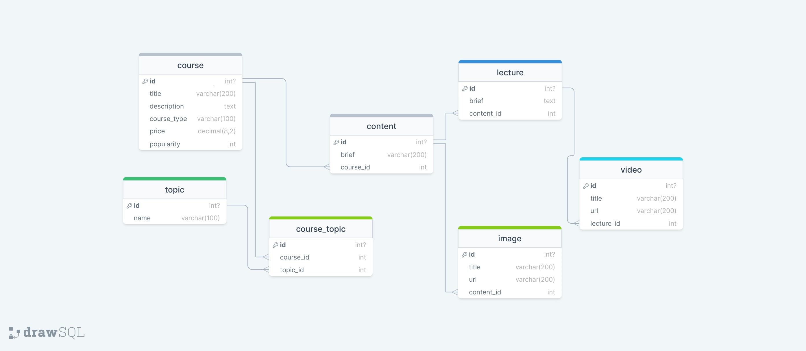

# CourseOne Project

CourseOne is a web application that provides an extensive REST API for a Coursera-like website. It allows users to browse courses, view course details, and apply filters based on type, price, popularity, and topics. The project is built using Django and MySQL, and follows a Model-View-Controller (MVC) architecture.

## Features

- Courses List: View a list of courses with filtering options.
- Single Course Details: View detailed information about a specific course, including videos, images, content, and lectures.
- Filter Courses: Apply filters based on type, price, popularity, and topics to narrow down the course list.
- Enroll in courses and complete the payment process using Razorpay integration.

## Project Schema



## Setup Instructions

Follow these steps to set up and run the CourseOne project on your local machine:

### Prerequisites

- Python (version 3.7 or higher)
- Django (version 3.x)
- MySQL (version 5.x)

### Installation

1. Clone the repository:
   git clone https://github.com/siddharthverma-1607/courseOne.git

2. Change into the project directory:
   cd courseone

3. Create a virtual environment:
   python3 -m venv myenv

4. Activate the virtual environment:

- On macOS/Linux:
  ```
  source myenv/bin/activate
  ```
- On Windows:
  ```
  myenv\Scripts\activate
  ```

5. Install the required dependencies:
   pip install -r requirements.txt

6. Create a MySQL database:

- Create a new database called `courseone` using your preferred MySQL management tool (e.g., MySQL Workbench).

7. Update the database settings:

- Open the `settings.py` file located in the `courseone` directory.
- Update the `DATABASES` section with your MySQL database details (database name, username, password).

8. Apply database migrations:
   python manage.py migrate

9. Dump data to courseone database by using the "insert_statements.sql" inside `docs` directory.

### Running the Project

1. Start the Django development server:
   python manage.py runserver

2. Access the application in your web browser:
   http://localhost:8000/

## Razorpay Integration

1. Obtain Razorpay API credentials:

   - Sign up for a Razorpay account at https://razorpay.com.
   - Generate your test API key and secret key from the Razorpay dashboard.

2. Configure the Razorpay API credentials:

   - Open `settings.py` and update the `RAZORPAY_KEY_ID` and `RAZORPAY_KEY_SECRET` variables with your test API key and secret key. [default test key id are present]

3. Initiate Payment:

   - In the Django app, navigate to the course details page.
   - Click the "Pay Now" button to initiate the payment process.
   - Fill in the required payment details and proceed to payment.
   - Use the test card details provided by Razorpay for testing.

4. Handle Payment Response:
   - After the payment is processed, the user will be redirected to the payment success page.
   - Verify that the payment response is processed correctly by checking the logs or database.
   - Update your application logic as needed based on the payment response.

## DEMO: Rest API

[](https://drive.google.com/file/d/1NTy7l3WpY-5JIwLJGHYDKcIdxZS28IKg/view)

## DEMO: Razorpay Integration

[](https://drive.google.com/file/d/1B4Fji7FJx-4HtMvijGhF2x1AiTRdVpb9/view)

## Contribution

Contributions to the CourseOne project are welcome! If you find any issues or want to add new features, feel free to create a pull request.

## License

This project is licensed under the [MIT License](LICENSE).
